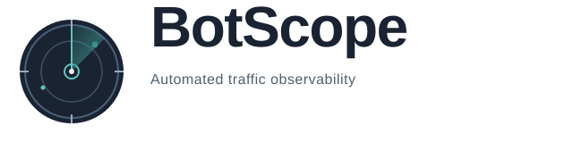
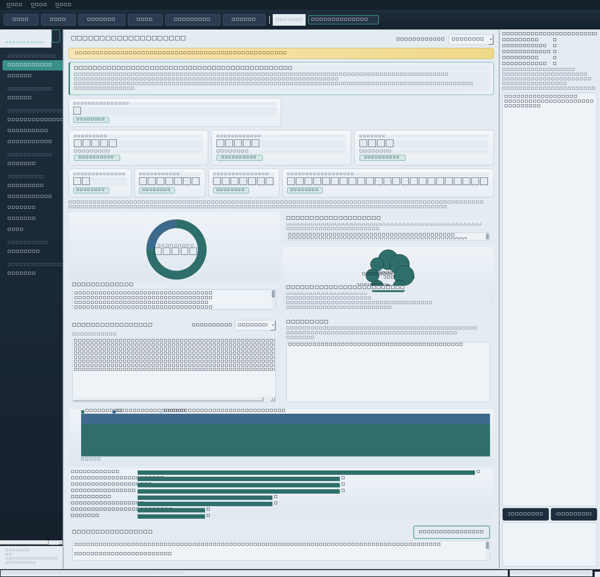
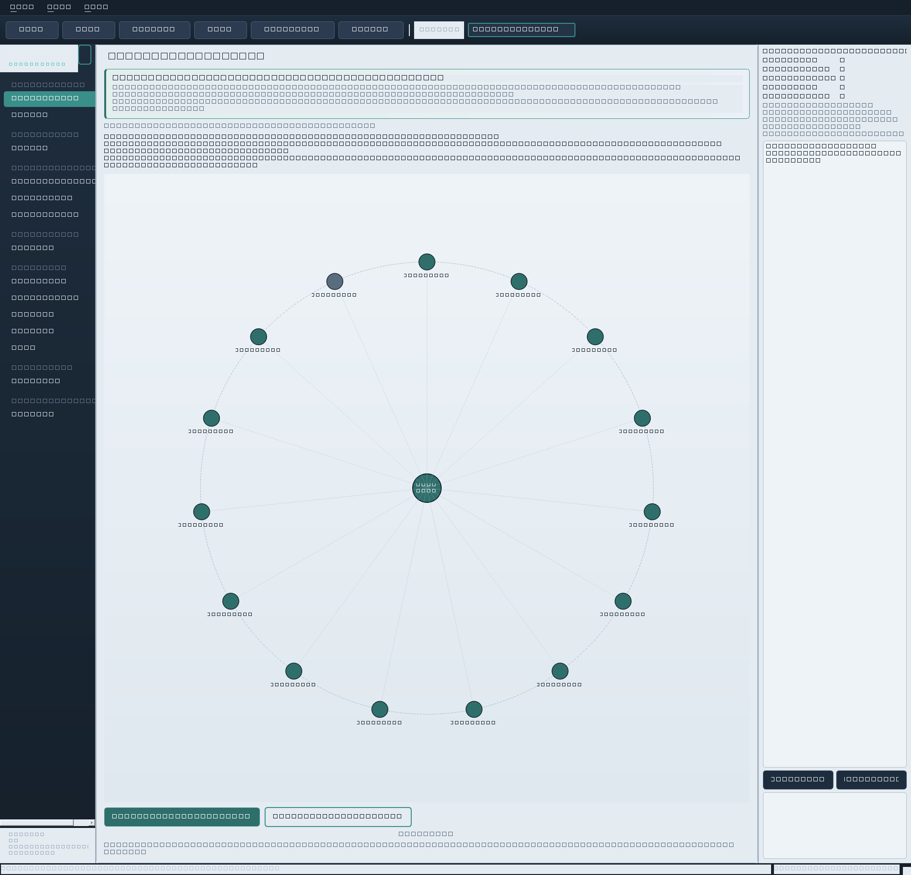
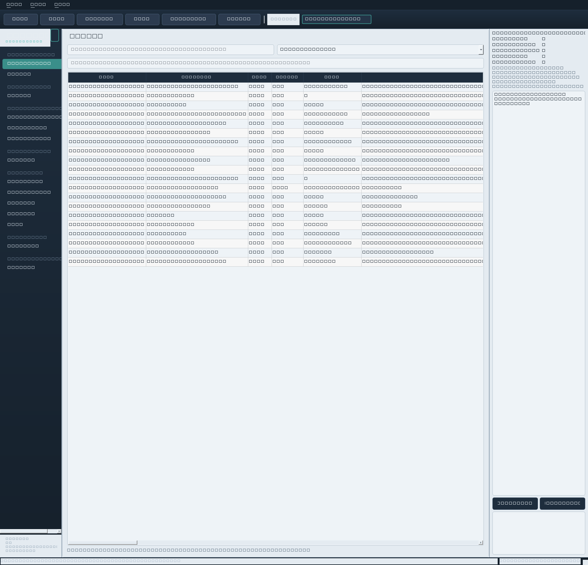
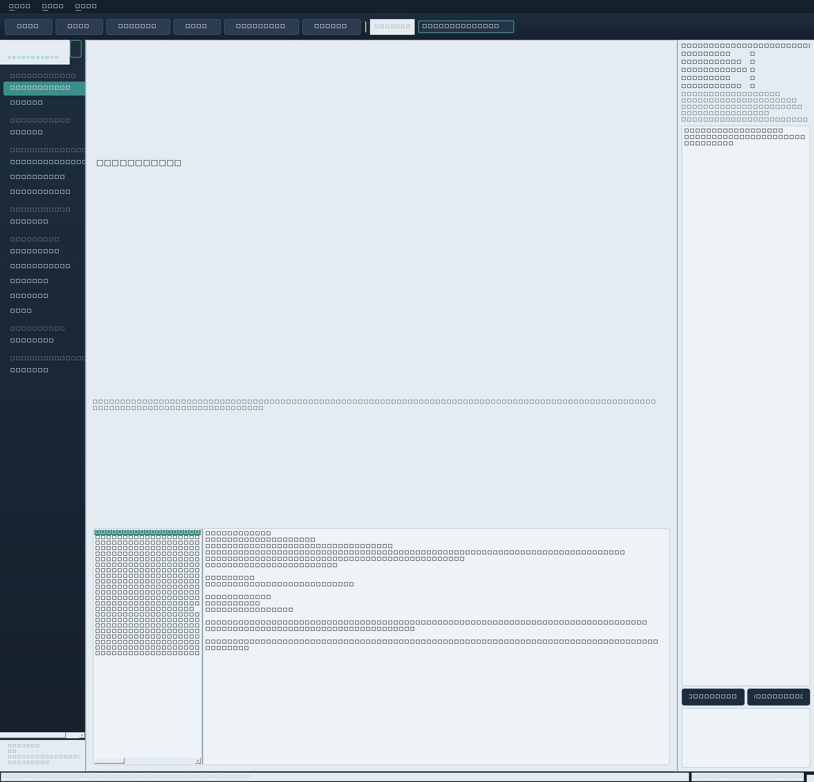
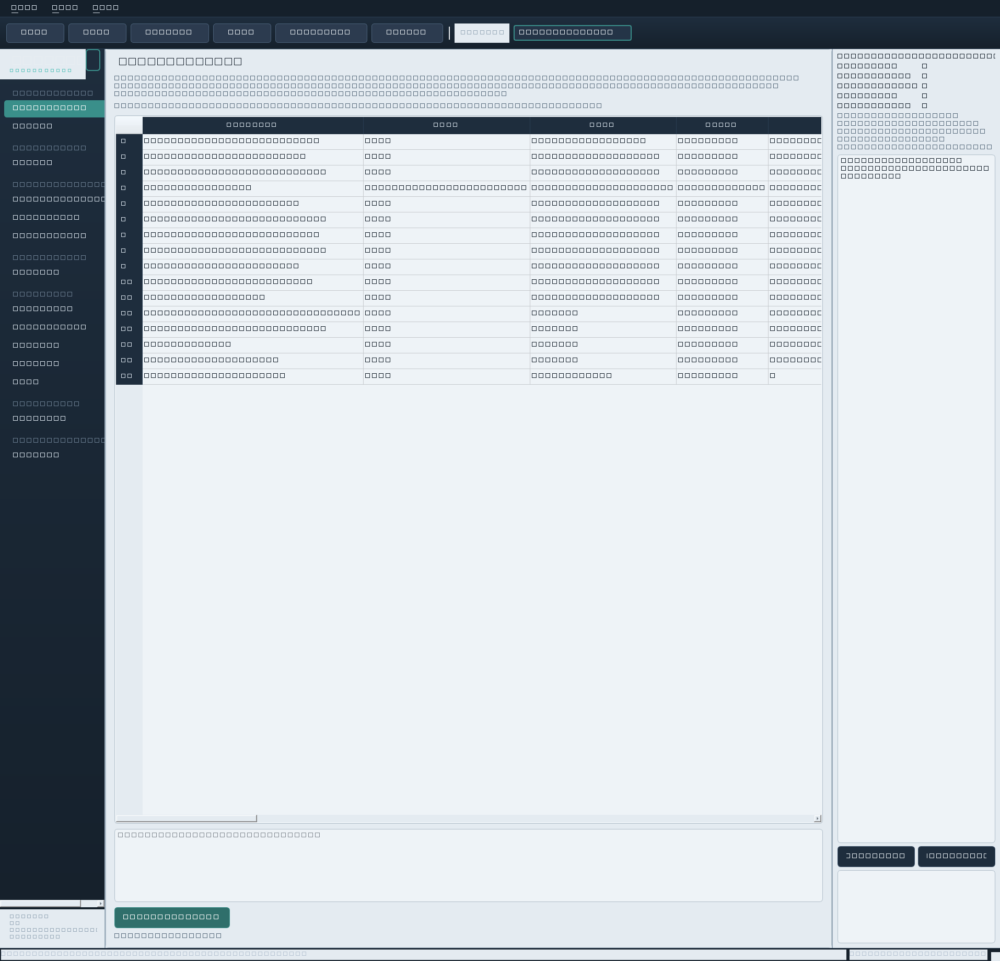
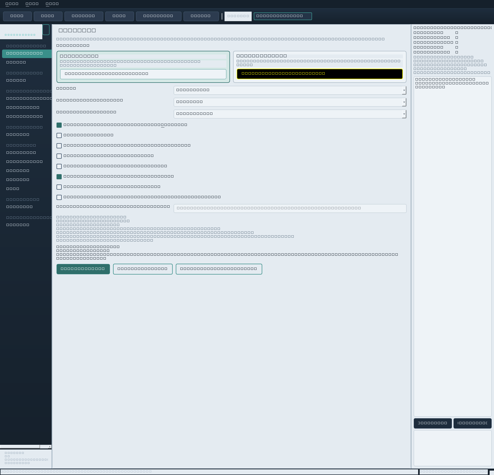
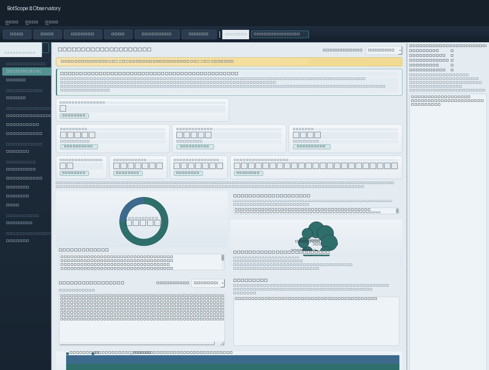

# BotScope



**Python-first observability for an Internet-wide census of automated traffic.**

BotScope is an **Internet-wide bot traffic census**: the Global Observatory federates public crawler/IP panels, crawl catalogs, and optional CDN estimates into a worldwide automation picture — alongside a local analyzer and native Qt desktop Observatory for authorized logs, sessions, and live capture.

[](https://github.com/theworker02/botscope/actions/workflows/ci.yml)
[](https://www.python.org/downloads/)
[](LICENSE)
[](https://github.com/theworker02/botscope)
[](docs/GUI.md)
[](https://docs.astral.sh/ruff/)
[](https://github.com/theworker02/botscope/actions/workflows/ci.yml)
[](CHANGELOG.md)

> Network contribution is **OFF by default**. BotScope does not perform unauthorized scanning.
> Zero-config for your own logs: **no account**, **no cloud profile**, and **no API key** required to classify local traffic.

---

## Screenshots

<p align="center">
  
</p>

*Observatory — KPI cards, composition ring, Traffic Pulse, and category breakdown on the bundled synthetic demo corpus (DEMO DATA banner visible).*

| | |
|:--:|:--:|
| <br/>*Global — Internet-wide census from zero-auth public sources; Cloudflare Radar optional* | <br/>*Events — virtualized table, query language, Classification Inspector* |
| <br/>*Bot Library — known signatures vs observed-in-dataset markers* | <br/>*Sources — registry status for public feeds and optional providers* |

<p align="center">
  
</p>

*Settings — local theme, privacy, and optional Cloudflare Radar token for CDN estimates (field shown empty; no account required).*

---

## Video demo

Animated tour of the main Observatory pages (demo data):

<p align="center">
  
</p>

[Screenshot strip](docs/assets/demo/botscope-tour-strip.png) · [Recording script / MP4 placeholder](docs/assets/demo/README.md)

To capture a short screen recording yourself (launch → Demo → KPIs → Global → Events), follow the steps in [`docs/assets/demo/README.md`](docs/assets/demo/README.md) and drop `botscope-demo.mp4` (or `.webm`) beside the GIF.

---

## What BotScope is

BotScope is an **Internet-wide census of automated traffic**, with a local measurement workstation for traffic you are authorized to analyze:

- Build a **worldwide automation census** in Global Observatory from federated zero-auth public sources (crawler IP ranges, Common Crawl catalog, and similar) plus optional Cloudflare Radar CDN estimates
- Classify requests from combined/common access logs (and optional PCAP / live paths)
- Separate **OBSERVED** totals from **CLASSIFIED** shares, with provenance badges
- Keep an honest **UNKNOWN** outcome instead of forcing certainty
- Explore both **global census views** and local sessions in a **native desktop Observatory** (Qt / PySide6 — not a website)

## What BotScope is not

- **Not** limited to a single site or sensor — Global Observatory is the Internet-wide census surface
- **Not** a claim that one local log alone equals the whole Internet (local shares stay labeled local; the census comes from federated global sources)
- **Not** a cloud SaaS — analysis and preferences stay on your machine by default
- **Not** a substitute for authorization: only analyze systems and traffic you own or have permission to measure

The product’s primary global story is the **Internet-wide census**. Local Observatory KPIs remain dataset-scoped so you can compare your sensors against that census without conflating the two.

---

## Features

| Area | What you get |
|------|----------------|
| **Observatory KPIs** | Automated / human-likely / unknown shares, request & byte totals, quality hint, observation window |
| **Composition ring** | Visual breakdown of classified traffic with actor callouts |
| **Traffic Pulse** | Short trend readout for the loaded dataset view |
| **Global Observatory** | Internet-wide automation census from zero-auth public sources (e.g. Common Crawl, Google/Bing crawler ranges); optional Cloudflare Radar for CDN estimates |
| **Bot Library** | Known signature packs vs bots actually observed in the current dataset |
| **Dataset Health** | Multi-dimension quality scorecard for the loaded session |
| **Events** | Virtualized event browser, quick search, shared safe query language |
| **Compare** | Session-to-session deltas and classifier-vs-labels panels (no causal claims) |
| **Provenance** | OBSERVED vs CLASSIFIED vs INFERRED — numbers keep their lineage |
| **Exports** | Multi-format reports (Markdown, HTML, JSON, CSV) and research export helpers |
| **Live capture** | Authorized log-tail and optional local-interface sniff; measured rates only |
| **CLI + Python API** | Headless analyze / query / report / doctor alongside the GUI |
| **Privacy transforms** | Optional IP hashing/truncation and query redaction on ingest |

Full matrix: [`FEATURES.md`](FEATURES.md). Machine-readable registry: `botscope features`.

---

## Quickstart

Requires **Python 3.10+**.

```bash
git clone https://github.com/theworker02/botscope.git
cd botscope
python -m venv .venv
# Windows: .venv\Scripts\activate
# macOS/Linux: source .venv/bin/activate
pip install -e ".[gui,dev]"
```

Environment check and synthetic demo:

```bash
botscope doctor
botscope demo --output demo_analysis.bscope
botscope open demo_analysis.bscope
```

Desktop Observatory:

```bash
botscope gui
# or simply: botscope
```

In the GUI: **Demo** loads the bundled synthetic corpus (shows a **DEMO DATA** banner). **Open** analyzes an authorized access log. Drag-and-drop of logs, PCAPs, or `.bscope` sessions is supported.

Analyze a log from the CLI:

```bash
botscope analyze path/to/access.log --output analysis.bscope
botscope report analysis.bscope --format markdown --output report.md
```

Python API:

```python
from botscope import Analyzer

result = Analyzer().analyze("access.log")
print(result.automation_fraction)
print(result.stats.by_category)
```

More detail: [`docs/guides/QUICKSTART.md`](docs/guides/QUICKSTART.md) · [`docs/guides/INSTALLATION.md`](docs/guides/INSTALLATION.md)

---

## CLI overview

`botscope` with no subcommand launches the Observatory. Use `--no-gui` to print help without opening a window.

| Command | Purpose |
|---------|---------|
| `doctor` | Environment / policy diagnostics |
| `demo` | Analyze bundled synthetic corpus (always labeled DEMO) |
| `analyze` | Analyze an authorized log or PCAP |
| `open` | Summarize an existing `.bscope` session |
| `query` | Filter events with the shared query language |
| `report` / `export` | Emit reports from a session |
| `gui` | Launch the native desktop Observatory |
| `compare` / `compare-classifiers` | Session and classifier comparisons |
| `quality` / `provenance` | Scorecard and provenance summaries |
| `live-tail` / `capture` | Authorized live log-tail / local sniff helpers |
| `federation` | Collect Global Observatory public-source snapshot |
| `citation` | Software citation helpers (no invented DOI) |
| `features` | Capability registry |
| `quickstart` | Print the fastest path to a first result |

Run `botscope --help` or `botscope <command> --help` for options. Tutorials live under [`docs/tutorials/`](docs/tutorials/).

---

## Architecture (summary)

```
Access log / PCAP / live sensor
        │
        ▼
   Ingest + privacy transforms
        │
        ▼
   Classify (rules, identity, optional ML)
        │
        ├──► .bscope session store (events, aggregates, workspace)
        ├──► CLI reports / export / research packs
        └──► Observatory GUI (KPIs, Events, Global census, Live, …)
                 │
                 └──► Global federation → Internet-wide census
                      (zero-auth public sources; Cloudflare Radar if you supply a token)
```

- **Internet-wide census**: Global Observatory is the census product — federated public panels and optional CDN estimates.
- **Local-first**: sessions and preferences stay on disk unless you explicitly enable network contribution.
- **Provenance-aware**: OBSERVED counts are never relabeled as CLASSIFIED shares; local KPIs stay distinct from the global census.
- Methodology notes: [`docs/research/METHODOLOGY.md`](docs/research/METHODOLOGY.md) · [`docs/research/GLOBAL_ESTIMATION.md`](docs/research/GLOBAL_ESTIMATION.md).

Deeper maps: [`docs/architecture/REPOSITORY_MAP.md`](docs/architecture/REPOSITORY_MAP.md) · diagrams in [`docs/architecture/diagrams/`](docs/architecture/diagrams/) · GUI guide [`docs/GUI.md`](docs/GUI.md)

---

## Documentation

| Doc | Description |
|-----|-------------|
| [`docs/README.md`](docs/README.md) | Documentation index |
| [`docs/guides/QUICKSTART.md`](docs/guides/QUICKSTART.md) | Fastest path to a first analysis |
| [`docs/guides/INSTALLATION.md`](docs/guides/INSTALLATION.md) | Install, extras, verify |
| [`docs/GUI.md`](docs/GUI.md) | Observatory desktop application |
| [`docs/QUERY.md`](docs/QUERY.md) | Safe query language (CLI + GUI + Python) |
| [`docs/CAPTURE.md`](docs/CAPTURE.md) | Authorized capture notes |
| [`docs/PRIVACY.md`](docs/PRIVACY.md) | Privacy transforms and boundaries |
| [`docs/GLOSSARY.md`](docs/GLOSSARY.md) | Terms (OBSERVED, CLASSIFIED, …) |
| [`docs/research/METHODOLOGY.md`](docs/research/METHODOLOGY.md) | Measurement methodology |
| [`docs/research/LIMITATIONS.md`](docs/research/LIMITATIONS.md) | What BotScope will not claim |
| [`docs/sources/SOURCE_RESEARCH.md`](docs/sources/SOURCE_RESEARCH.md) | Public source inventory |
| [`FEATURES.md`](FEATURES.md) | Feature matrix vs repository reality |
| [`CHANGELOG.md`](CHANGELOG.md) | Release notes |
| [`examples/`](examples/) | Runnable scripts |

Asset inventory (logos, screenshots, demo): [`docs/assets/README.md`](docs/assets/README.md)

---

## Optional extras

| Extra | Purpose |
|-------|---------|
| `gui` | PySide6 + pyqtgraph desktop Observatory |
| `capture` | scapy (authorized live interface sniff) |
| `network` | httpx / cryptography for opt-in network client |
| `ml` | numpy / scikit-learn classifier hooks |
| `analytics` | duckdb / pyarrow |
| `dev` | pytest, ruff, mypy |
| `all` | everything above |

```bash
pip install -e ".[gui,network,dev]"
```

Cloudflare Radar is **optional**. Leave Settings blank for normal local-log workflows; add *your* Radar Read token only if you want CDN bot/human estimates in Global Observatory. See [`docs/sources/CLOUDFLARE_RADAR.md`](docs/sources/CLOUDFLARE_RADAR.md).

---

## Principles

1. Treat **Global Observatory as an Internet-wide census**, built from federated sources with provenance  
2. Prefer **UNKNOWN** over forced certainty  
3. Separate **OBSERVED** counts from **CLASSIFIED** shares — and local KPIs from the global census  
4. Privacy transforms and local-first storage by default  
5. Network contribution remains **OFF** unless explicitly enabled  

---

## Contributing

Development setup, style (Ruff), and PR guidelines: [`CONTRIBUTING.md`](CONTRIBUTING.md).  
Code of conduct: [`CODE_OF_CONDUCT.md`](CODE_OF_CONDUCT.md).  
Security reports: [`SECURITY.md`](SECURITY.md) (do not file public issues for vulnerabilities).  
Support pointers: [`SUPPORT.md`](SUPPORT.md).

```bash
pip install -e ".[dev]"
pytest
ruff check src tests scripts
```

---

## License

Apache License 2.0 — see [`LICENSE`](LICENSE).

Citation helpers: `botscope citation` and [`CITATION.cff`](CITATION.cff).
