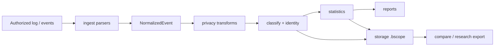

# Data path

```mermaid
flowchart LR
  Source[Authorized log / events] --> Ingest[ingest parsers]
  Ingest --> Normalize[NormalizedEvent]
  Normalize --> Privacy[privacy transforms]
  Privacy --> Classify[classify + identity]
  Classify --> Stats[statistics]
  Stats --> Reports[reports]
  Classify --> Session[storage .bscope]
  Stats --> Session
  Session --> Compare[compare / research export]
```

Status: IMPLEMENTED for offline path.
